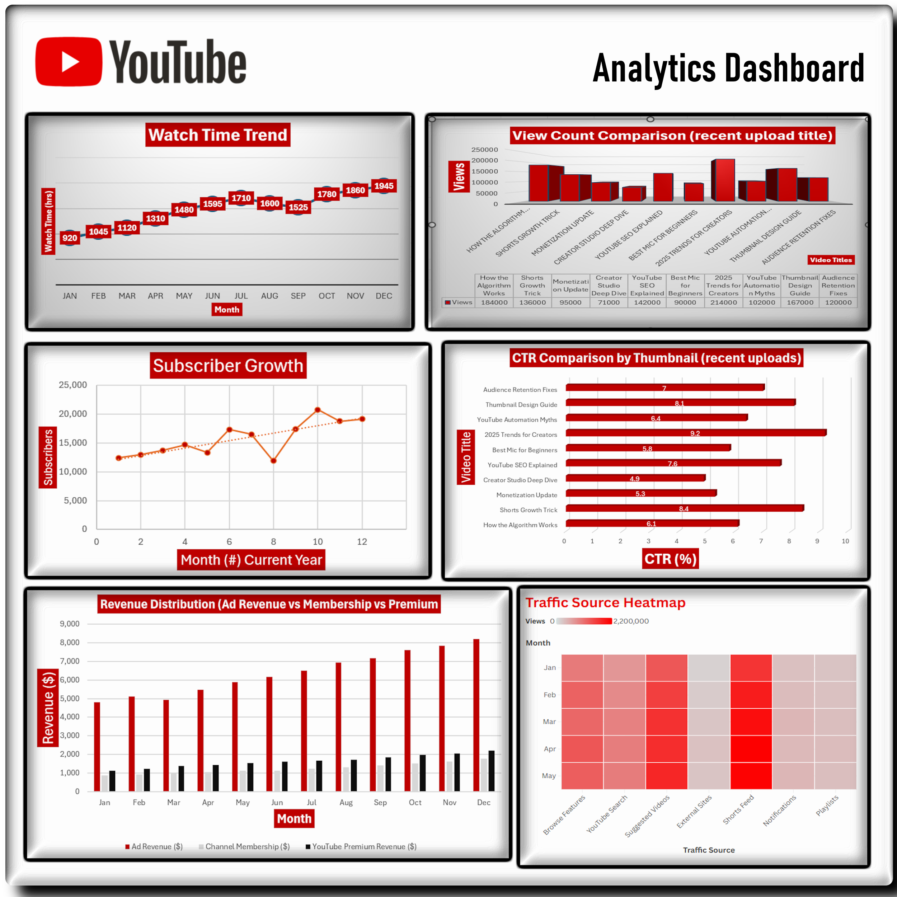

# Web Analytics Coursework

This collection focuses on using analytics to explain user behavior and support practical decisions. The work covers higher-education analytics, financial visualization, social-media measurement, YouTube dashboard design, and responsible data use.

## Projects

- [Georgia State University Analytics Case Study](K.McMahon_Deliverable1_10122025.docx): reviews how predictive analytics and proactive advising supported student outcomes.
- [Expanded Georgia State University Evaluation](K.McMahon_Deliverable2_10232025.docx): retains the completed case-study submission and supporting recommendations.
- [Financial Visualization Proposal](K.McMahon_Deliverable3_10302025.docx): recommends dashboard tools, chart choices, public financial data sources, and automated collection for a consulting firm.
- [Social Media Analytics Presentation](K.McMahon_Deliverable4_1162025.pptx): maps growth goals to KPIs, collection methods, segmentation, sentiment, and dashboard decisions for a music platform.
- [Financial Dashboard Guidance](K.McMahon_Deliverable5_11172025.docx): presents practical financial visualization and dashboard design recommendations.
- [Revised Financial Dashboard Guidance](K.McMahon_Deliverable5_11202025.docx): preserves the later version of the Module 5 proposal.
- [YouTube Analytics Dashboard Proposal](K.McMahon_Deliverable6_11292025.docx): defines watch time, views, click-through rate, subscriber change, revenue, and traffic-source metrics, then interprets the yearly trends.
- [Comprehensive Website Analytics Presentation](K.McMahon_Deliverable7_12162025.docx.pptx): connects web metrics, big-data challenges, dashboard design, privacy, ownership, and transparent reporting.

## Dashboard Evidence

[Book1.xlsx](Book1.xlsx) contains the sample financial data and chart inputs used for the visualization work.
