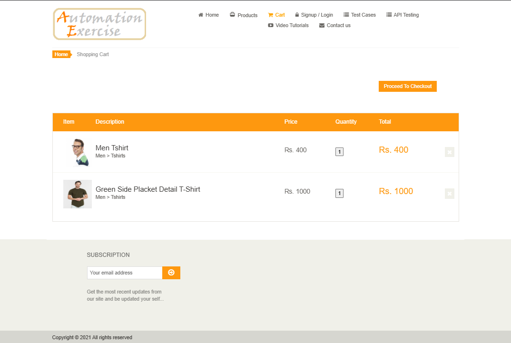

  

# Manual Execution Evidence

This folder contains sanitized screenshots captured during manual execution of the Automation Exercise test repository. File names use the corresponding test case ID so evidence can be traced directly from the test repository and RTM.

## Evidence Examples

| Area | Example |
|---|---|
| Authentication | [AE-LOGIN-001](AE-LOGIN-001.png) |
| Product search | [AE-PRODUCT-002](AE-PRODUCT-002.png) |
| Cart | [AE-CART-001](AE-CART-001.png) |
| Contact form | [AE-CONTACT-001](AE-CONTACT-001.png) |

Screenshots support an execution record but do not replace its expected result, actual result, status, or defect disposition. Failure images such as `TEST-FAIL-1.png` and `TEST-FAIL-2.png` are retained as supplementary diagnostic evidence.

## Related Artifacts

- [Manual test repository](../Test%20Cases/Automation%20Exercise%20-%20Test%20Case%20Repository.xlsx)
- [Defect log](../Bug%20Report/Automation%20Exercise%20Defect%20Log.xlsx)
- [Requirements Traceability Matrix](../Test%20Plan/Automation%20Exercise%20Requirements%20Traceability%20Matrix.xlsx)
