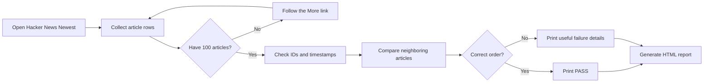

<p align="center">
  
</p>

<h1 align="center">Hacker News Sorting Validation</h1>

<p align="center">
  A Playwright coding challenge that verifies exactly the first 100 Hacker News articles are sorted from newest to oldest.
</p>

<p align="center">
  <strong>JavaScript</strong> | <strong>Playwright</strong> | <strong>Chromium</strong> | <strong>HTML Reporting</strong>
</p>

## Project Synopsis

This take-home project uses Playwright and JavaScript to collect exactly the first 100 articles from Hacker News, verify that they are ordered from newest to oldest across multiple pages, and generate a branded HTML evidence report for the completed run.

## Result

```text
Collected 30 of 100 articles (Hacker News page 1).
Collected 60 of 100 articles (Hacker News page 2).
Collected 90 of 100 articles (Hacker News page 3).
Collected 100 of 100 articles (Hacker News page 4).

PASS: Exactly 100 articles are sorted newest to oldest.
```

The test creates a styled HTML evidence report containing the run result, duration, pages inspected, and all 100 verified articles.

[View the latest HTML evidence report](reports/qa-wolf-hacker-news-report.html)

## Challenge

The goal was to use JavaScript and Playwright to:

1. Visit [Hacker News Newest](https://news.ycombinator.com/newest).
2. Collect exactly the first 100 articles.
3. Confirm that they are ordered from newest to oldest.
4. Produce a successful, repeatable execution.

Hacker News displays about 30 articles per page, so reaching 100 articles requires pagination across four pages.

## Test Flow



## What the Test Validates

- Exactly 100 articles are collected.
- Every article has a unique Hacker News ID.
- Every article has a usable timestamp.
- Each article is newer than or equal to the article that follows it.
- Pagination continues until the required count is reached.
- Temporary navigation failures receive up to three attempts.
- The browser closes after both successful and failed runs.

Equal timestamps are accepted because two articles can be submitted during the same second.

## Why Exact Timestamps Matter

Hacker News displays relative labels such as `5 minutes ago`, but the page also provides exact timestamps.

The test uses the exact value because it is:

- More precise
- Easier to compare
- Less likely to change during execution
- Better evidence when diagnosing a failure

## HTML Evidence Report

Every run writes a fresh report to:

```text
reports/qa-wolf-hacker-news-report.html
```

The report includes:

- Clear PASS or FAIL result
- Number of articles collected
- Unique article count
- Number of pages inspected
- Total execution time
- Test assumptions
- All 100 article titles and timestamps
- Direct links to each Hacker News item
- Row-level verification status
- Detailed diagnostics when validation fails

Headed runs open the report automatically in the default browser.

## Run Locally

### 1. Install dependencies

```bash
npm install
```

### 2. Install Chromium if Playwright requests it

```bash
npx playwright install chromium
```

### 3. Run headlessly

```bash
npm test
```

### 4. Run with Chromium visible

```bash
npm run test:headed
```

On Windows PowerShell, use `npm.cmd` if the local execution policy blocks `npm`:

```powershell
npm.cmd run test:headed
```

## Project Structure

```text
QA Wolf Take Home/
|-- assets/
|   `-- qa-wolf-logo.png
|-- reports/
|   `-- qa-wolf-hacker-news-report.html
|-- index.js
|-- index-explained.js
|-- reporter.js
|-- package.json
|-- package-lock.json
`-- README.md
```

| File | Purpose |
|---|---|
| `index.js` | Runs the browser, collects articles, and validates chronological order |
| `index-explained.js` | Study copy with short plain-language comments |
| `reporter.js` | Builds and opens the HTML evidence report |
| `reports/qa-wolf-hacker-news-report.html` | Latest saved execution evidence |
| `assets/qa-wolf-logo.png` | Local branding asset used by the report and README |

## Design Decisions

### Stop at exactly 100

The fourth Hacker News page contains more articles than needed. The collector stops as soon as the results array reaches 100.

### Validate the validator's inputs

The test checks IDs and timestamps before comparing dates. A result should not pass when its underlying evidence is incomplete.

### Use bounded retries

The script retries temporary page-loading problems up to three times. The limit improves reliability without hiding a persistent failure.

### Create evidence for people

Terminal output is useful for the person running the test. The HTML report makes the result easier for customers, managers, and other stakeholders to review.

## Skills Demonstrated

- Browser automation with Playwright
- CSS locator selection
- Pagination handling
- Asynchronous JavaScript
- Data extraction and validation
- Chronological comparisons
- Defensive error handling
- Duplicate detection
- Automated HTML reporting
- Customer-focused presentation of QA evidence

## Original Assignment

This project was created for the [QA Wolf QA Engineer coding challenge](https://www.task-wolf.com/apply-qae). The original requirement was to edit `index.js`, use Playwright, and verify exactly the first 100 Hacker News articles are sorted from newest to oldest.

## Author

**Kevin McMahon**  
QA Analyst portfolio project
