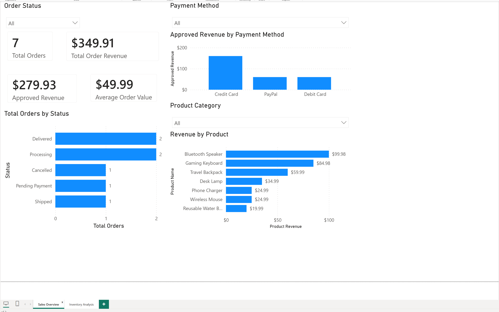
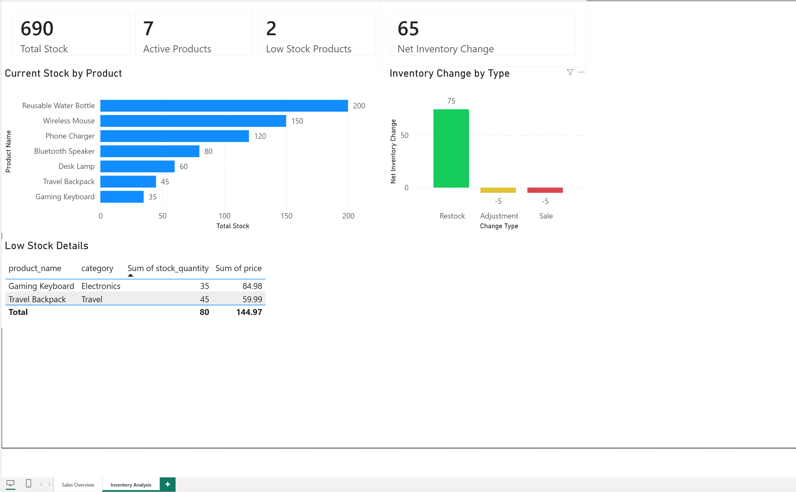

# Online Sales Portal Power BI Dashboard

This two-page Power BI report turns the fictional `online_sales_portal` MySQL database into an interactive sales and inventory analysis dashboard. It demonstrates data preparation, relational modeling, DAX measures, KPI design, filtering, and business-focused visualization.

## Dashboard File

- [Download the Power BI report](online_sales_portal_dashboard.pbix)

> The report uses imported, sanitized sample data. Power BI Desktop is required to open the `.pbix` file. A local MySQL connection is only required to refresh the source data.

## Sales Overview

The Sales Overview page summarizes order activity and revenue performance. Dropdown slicers allow the report to be explored by order status, product category, and payment method.



### Included analysis

- Total orders
- Total order revenue
- Approved payment revenue
- Average order value
- Orders by fulfillment status
- Approved revenue by payment method
- Revenue by product
- Interactive order-status, product-category, and payment-method filters

### Key observations

- The sample contains **7 orders** totaling **$349.91**.
- Approved payments account for **$279.93** in revenue.
- The average order value is **$49.99**.
- Credit Card is the leading approved-payment method.
- Bluetooth Speaker is the highest-revenue product at **$99.98** across two orders.

## Inventory Analysis

The Inventory Analysis page monitors current stock, active products, low-stock exposure, and inventory movements.



### Included analysis

- Total stock on hand
- Active-product count
- Low-stock product count using a threshold below 50 units
- Net inventory change
- Current stock by product
- Inventory movement by change type
- Low-stock product detail table

### Key observations

- Current stock totals **690 units** across **7 active products**.
- **2 products** fall below the 50-unit low-stock threshold.
- Gaming Keyboard has 35 units and Travel Backpack has 45 units.
- Recorded inventory activity produces a net increase of **65 units**.
- Restocks added 75 units, while sales and adjustments removed 10 units.

## Data Model

The report imports six related MySQL tables:

- `customers`
- `orders`
- `order_items`
- `products`
- `payments`
- `inventory_logs`

The model uses active, single-direction, one-to-many relationships:

| Parent table | Child table | Relationship |
|---|---|---|
| `customers[customer_id]` | `orders[customer_id]` | One to many |
| `orders[order_id]` | `order_items[order_id]` | One to many |
| `orders[order_id]` | `payments[order_id]` | One to many |
| `products[product_id]` | `order_items[product_id]` | One to many |
| `products[product_id]` | `inventory_logs[product_id]` | One to many |

## DAX Measures

```DAX
Total Order Revenue = SUM(orders[order_total])

Approved Revenue =
CALCULATE(
    SUM(payments[payment_amount]),
    payments[payment_status] = "Approved"
)

Total Orders = DISTINCTCOUNT(orders[order_id])

Average Order Value =
DIVIDE(
    [Total Order Revenue],
    [Total Orders],
    0
)

Product Revenue = SUM(order_items[line_total])

Total Stock = SUM(products[stock_quantity])

Active Products =
CALCULATE(
    DISTINCTCOUNT(products[product_id]),
    products[is_active] = 1
)

Low Stock Products =
CALCULATE(
    DISTINCTCOUNT(products[product_id]),
    products[stock_quantity] < 50
)

Net Inventory Change = SUM(inventory_logs[quantity_changed])
```

## Data Preparation

Power Query was used to:

- Validate numeric, text, currency, and date/time data types
- Retain primary and foreign keys required by the model
- Remove nested ODBC navigation columns
- Preserve transaction-level sales, payment, and inventory records

## Related Project Files

- [Database schema](../Database/online_sales_portal_schema.sql)
- [Sanitized sample data](../Database/online_sales_portal_sample_data.sql)
- [SQL analysis queries](../Queries/online_sales_portal_analysis.sql)
- [SQL query results report](../Documentation/online_sales_portal_query_results_report.md)

## Skills Demonstrated

- MySQL-to-Power BI connectivity through ODBC
- Power Query transformation and data-type validation
- Relational data modeling and relationship cardinality
- DAX measure creation
- KPI, bar-chart, column-chart, table, and slicer configuration
- Interactive dashboard design
- Business insight communication

